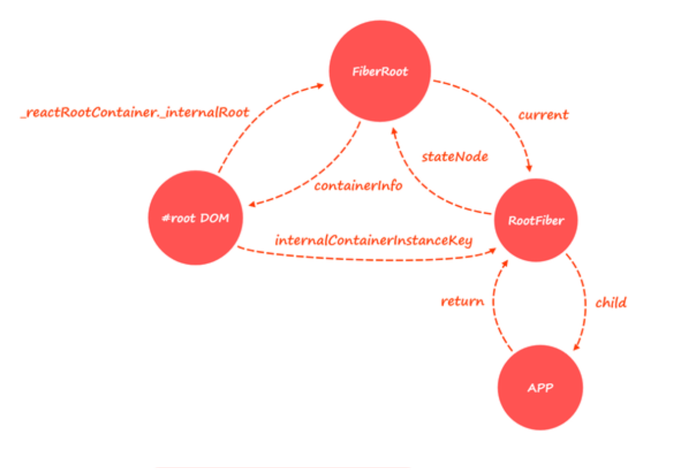

## Fiber 的初衷

V16 之前的 React，触发一次渲染，所有操作都是同步的，包括生命周期函数的执行，diff，最终更新 dom 等，假设这个过程会持续 500ms，那么这期间就会一直霸占浏览器渲染进程中的主线程，此时对于用户而言，这个网页是处于卡死状态的，比如在一个 input 框进行键盘输入会得不到即时反应（此类操作是否可以由 Compositor 线程处理？），待 500ms 过后之前输入的一下子蹦出来了。

怎么优化呢？如果把 500ms 的同步任务分片成 50 个 10ms 的任务，虽然总时间没变，但是主线程不会在 500ms 中被一个任务独占，期间可以处理其他优先级更高的任务，之前 input 框键盘输入的情况就会每 10ms 就得到浏览器的反馈，当然上述说的数值都是一个举例。V16 之后的 React 确实是按照这个思路做的，而 Fiber 就是支持时间分片和任务调度的数据结构。

## 宏观认知

触发渲染有两个入口：

1. 第一次挂载，即 ReactDOM.render；
2. 后续的更新，即调用 setState。

两者整体流程线是差不多的，当然也会有区别，在第一次挂载时会先创建如下的结构：



两种渲染的整体流程线对比如下：

- 第一次挂载流程

```ts
const ReactDOM = {
  // ReactDOMLegacy.js
  render(element, container, callback) {
    function legacyRenderSubtreeIntoContainer(
      parentComponent,
      children,
      container,
      forceHydrate,
      callback,
    ) {
      // ✨创建fiberRoot和rootFiber，作为此次渲染树结构的根部分，清空container的子节点
      let root = (container._reactRootContainer = legacyCreateRootFromDOMContainer(
        container,
        forceHydrate,
      ));
      fiberRoot = root._internalRoot;
      unbatchedUpdates(() => {
        // ReactFiberReconciler.js
        function updateContainer(element, container, parentComponent) {
          // ✨更新入口
          scheduleUpdateOnFiber(current, lane, eventTime);
        }
        updateContainer(children, fiberRoot, parentComponent, callback);
      });
    }
    return legacyRenderSubtreeIntoContainer(
      null,
      element,
      container,
      false,
      callback,
    );
  },
};
```

- 后续的更新

```ts
class Component {
  constructor() {
    this.updater = {
      // ReactFiberClassComponent.js
      enqueueSetState(inst, payload, callback) {
        const fiber = getInstance(inst);
        const update = createUpdate(eventTime, lane, suspenseConfig);
        update.payload = payload;
        // 将待更新的内容挂载到fiber.updateQueue上
        enqueueUpdate(fiber, update);
        // ✨更新入口
        scheduleUpdateOnFiber(fiber, lane, eventTime);
      },
    };
  }
  setState() {
    this.updater.enqueueSetState(this, partialState, callback, 'setState');
  }
}
```

```ts
// ReactFiberWorkLoop.js
function scheduleUpdateOnFiber(fiber, lane, eventTime) {
  function performSyncWorkOnRoot(root) {
    function renderRootSync(root: FiberRoot, lanes) {
      function workLoopSync() {
        function performUnitOfWork(unitOfWork: Fiber) {
          // ReactFiberBeginWork.js
          function beginWork(current: Fiber, workInProgress, renderLanes) {
            function updateFunctionComponent(
              current,
              workInProgress,
              Component,
              nextProps,
              renderLanes,
            ) {
              // diff
              reconcileChildren(
                current,
                workInProgress,
                nextChildren,
                renderLanes,
              );
            }
            switch (workInProgress.tag) {
              case FunctionComponent: {
                const Component = workInProgress.type;
                return updateFunctionComponent(
                  current,
                  workInProgress,
                  Component,
                  resolvedProps,
                  renderLanes,
                );
              }
              case ClassComponent: {
                const Component = workInProgress.type;
                return updateClassComponent(
                  current,
                  workInProgress,
                  Component,
                  resolvedProps,
                  renderLanes,
                );
              }
            }
          }
          // 从WIP.alternate中获得当前fiber
          const current = unitOfWork.alternate;
          // ✨begin work，新老fiber做对比
          let next = beginWork(current, unitOfWork, subtreeRenderLanes);
          if (next === null) {
            // ✨If this doesn't spawn new work, complete the current work.
            // 与performUnitOfWork相反，向上遍历
            completeUnitOfWork(unitOfWork);
          } else {
            workInProgress = next;
          }
        }
        while (workInProgress !== null) {
          // 开始执行work，向下遍历
          performUnitOfWork(workInProgress);
        }
      }
      workLoopSync();
    }
    // Render/reconciliation 阶段，向下遍历
    renderRootSync(root, lanes);
    // Commit阶段，遍历
    commitRoot(root);
  }
  // 从当前fiber向上遍历到root，并返回fiberRoot（应该是考虑到子节点也可能对父节点产生影响所以追溯到root再统一处理rootFiber.updateQueue）
  const root = markUpdateLaneFromFiberToRoot(fiber, lane);
  performSyncWorkOnRoot(root);
}
```

## 总结

上面这份脉络代码参考 V17.0.0-alpha.0，最后总结以下几点：

1. 一次渲染分成两个阶段，Render/reconciliation 和 Commit，前者可以被打断，后者一气呵成会阻塞浏览器渲染主线程；
2. 一个 work 分为两个步骤，begin 和 complete，前者从 root 向下遍历，后者从下向 root 遍历；
3. 渲染时会创建 WIP 树，挂载在 fiber.alternate 上，而 alternate.alternate 又指向 fiber，形成双向缓存，将要发生的变更都会先作用于 WIP 树，之后再与 fiber 做 diff；
4. Component 的 updater 是在 beginWork 阶段初始化的；

[1]: https://makersden.io/blog/look-inside-fiber
[2]: https://github.com/acdlite/react-fiber-architecture
[3]: https://zhuanlan.zhihu.com/p/26027085
[4]: https://link.zhihu.com/?target=https%3A//www.youtube.com/watch%3Fv%3DZCuYPiUIONs
