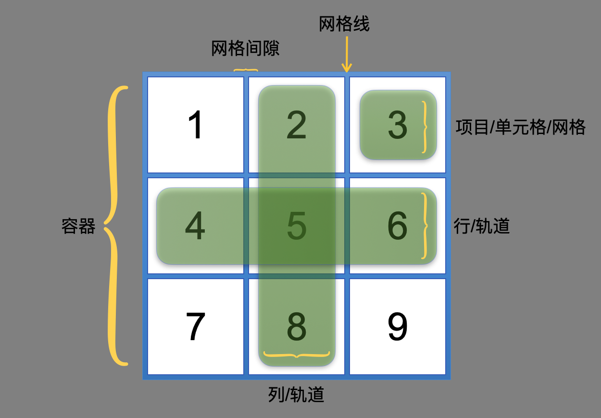

Grid 是一种二维布局，如上图所示，CSS 代码如下：

```css
.container {
  display: grid;
  grid-template-columns: repeat(3, 100px);
  grid-template-rows: repeat(3, 100px);
  grid-row-gap: 5px;
  grid-column-gap: 5px;
}
```

## 容器属性

### 网格模版

- `grid-template-columns: repeat(2, 1fr)`
- `grid-template-rows: repeat(2, 1fr)`

### 网格区域模版

其中定义的名称可以被其他属性使用。

```css
.container {
  grid-template-areas:
    'a a .'
    'a a .'
    '. b c';
}
```

### 网格间隙

- `row-gap: 20px;`
- `column-gap: 20px;`
- `gap: <row-gap> <column-gap>;`

### 网格排列顺序

- `grid-auto-flow: row | column | dense | row dense | column dense`

dense 表示稠密排列

### 网格内容排版

- `justify-items: start | end | center | stretch`
- `align-items: start | end | center | stretch`
- `place-items: <align-items> <justify-items>`

### 真实内容区域在容器中的排版

- `justify-content: start | end | center | stretch | space-around | space-between | space-evenly`
- `align-content: start | end | center | stretch | space-around | space-between | space-evenly`
- `place-content: <align-content> <justify-content>`

### 隐式创建轨道大小

- `grid-auto-rows`
- `grid-auto-columns`

当项目定义在 grid-template 尺寸之外或者由自动布局算法创建额外的轨道时，就会使用上述属性，可以使用 min-content 和 max-content 两个关键字。

### 简写

- grid-template： grid-template-columns、grid-template-rows 和 grid-template-areas 的简写
- grid：grid-template-rows、grid-template-columns、grid-template-areas、 grid-auto-rows、grid-auto-columns、grid-auto-flow 的简写

简写模式不够直观不推荐使用。

## 项目属性

### 网格定位

- grid-row-start
- grid-column-start
- grid-row-end
- grid-column-end
- `grid-row: <grid-row-start> / <grid-row-end>`
- `grid-column: <grid-column-start> / <grid-column-end>`

其中的值可以是：

- auto：默认
- integer：网格线的序号
- 自定义的网格线名称
- span integer：横跨几个网格

### 网格区域（网格定位）

- `grid-area: areaname`
- `grid-area: <grid-row-start> / <grid-column-start> / <grid-row-end> / <grid-column-end>`

areaname 是在 grid-template-areas 中自定义的 name，也可以是网格定位的简写。

## Grid 布局中的一些关键字或函数

### repeat()函数

- `grid-template-columns: repeat(3, 33.33%);`
- `grid-template-columns: repeat(2, 100px 20px 80px);`

表示重复几次相应的属性。

### minmax()函数

- `grid-template-columns: 1fr minmax(100px, 1fr)`

定义了一个范围闭区间，详细介绍请参考[这里](https://developer.mozilla.org/zh-CN/docs/Web/CSS/minmax)，其中可以使用 min-content 和 max-content 两个关键字。

### fit-content()函数

- `grid-template-columns: fit-content(300px) 1fr;`

第一列表示自适应内容宽度，但最大不超过 300px。

### fr 关键字

- `grid-template-columns: 1fr 2fr;`
- `grid-template-columns: 150px 1fr 2fr;`

表示后者是前者的两倍。

### auto-fill 关键字

- `grid-template-columns: repeat(auto-fill, 100px);`

当容器宽度不一定项目宽度固定为 100px 时，自动填充合适的项目个数。

### auto-fit 关键字

- `grid-template-columns: repeat(auto-fit, 100px);`

### auto 关键字

- `grid-template-columns: 100px auto 100px;`
- `grid-area: 2 / 2 / auto / auto;`

表示自适应宽度、默认跨度一格。

### 网格线的名称

- `grid-template-columns: [c1] 100px [c2 ctwo] 100px [c3] auto [c4];`

指定每一根网格线的名字，方便以后的引用。

## 注意事项

- 可以 F12 选择元素查看网格排版情况
- 像 justify-items 这类排版对齐属性，最早出现在 Flex 布局中，现在统一整理在[盒模型对齐 Level 3 规范](https://drafts.csswg.org/css-align/)中，或参考[这里](https://developer.mozilla.org/zh-CN/docs/Web/CSS/CSS_Grid_Layout/Box_Alignment_in_CSS_Grid_Layout)。
- 未指定 grid-template-columns 属性时，默认为 none，即所有的列和其大小都将由 grid-auto-columns 属性隐式的指定。

[1]: https://developer.mozilla.org/zh-CN/docs/Web/CSS/CSS_Grid_Layout
